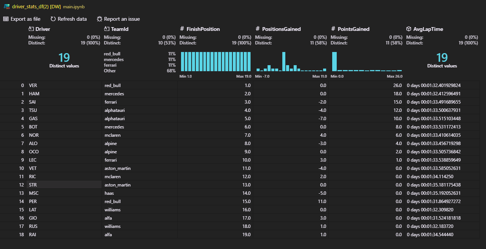

# f1_wdc_pred

## Milestone 1: Określenie tematu i analiza wymagań

Celem jest stworzenie modelu AI przewidującego końcowe wyniki WDC, wykorzystując dane historyczne, umiejętności kierowców i osiągnięcia zespołów. Zakres obejmuje zebranie danych, preprocessing, budowę modelu, ewaluację i demonstrację. Problem to złożoność przewidywania wyników w F1, gdzie wiele czynników ma wpływ na końcowy rezultat.

## Milestone 2: Zbiór danych i ich przygotowanie

Wykorzystywany zbiór danych: [FastF1](https://docs.fastf1.dev/index.html)

Przygotowanie dla jednego z wyścigów (FORMULA 1 ETIHAD AIRWAYS ABU DHABI GRAND PRIX 2021) wstępnego przygotowania i filtrowania danych

